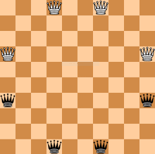

# Game-of-amazons-AI

The Game of the amazons is a two-player abstract strategy game that is played on a 10x10 chessboard.

## Rules
White moves first, and the players alternate moves thereafter. Each move consists of two parts. First, one moves one of one's own amazons one or more
empty squares in a straight line (orthogonally or diagonally), exactly as a queen moves in chess; it may not cross or enter a square occupied by an amazon
of either color or an arrow. Second, after moving, the amazon shoots an arrow from its landing square to another square, using another queenlike move.
This arrow may travel in any orthogonal or diagonal direction (even backwards along the same path the amazon just traveled, into or across the starting
square if desired). An arrow, like an amazon, cannot cross or enter a square where another arrow has landed or an amazon of either color stands.
The square where the arrow lands is marked to show that it can no longer be used. The last player to be able to make a move wins. Draws are impossible.

## The algorithm
An AI algorithm that plays game of the amazons. developed based on alpha-beta algorithm that was thaught in class.
the algorithm simulates a certain random number of moves the player/opponent could make then evaluate the end state of the board.
repeating the process with other set of random moves would lead to different states/scenario. with enough final states the algorithm would be able to decide his next move according
to the course of moves he finds optimal taking in consideration the opponent's possible moves.

The evaluation of each state is done by using a heuristic function which is an important concept of the algorithm. more accurate heuristic will lead to a better AI player.

## Heuristic function
  A heuristic function is a function that ranks alternatives in search algorithms at each branching
  step based on available information to decide which branch to follow.

  The Heuristic function used in the algorthim is the number of possible moves the player can make divided by the number of possible moves the two players can make

### Interesting aspects:

	1.Increased tree depth search the as the game progressed.
  
	2.The heuristic function depends on finding the next possible plays. Which allowed us to insert them in the hash-table while evaluating current play.
  
	3.depth search  is dependent on the game progress and time left of the player. 

### Possible improvements:

	1.While opponent player is playing the AI stands still. We could use that time to calculate next possible moves.
  
	2.The hash-table is not space effective; we stored the whole board each time we called the evolution function.
    could have used other storing methods for example: Zobrist hashing.
    
	3.The same heuristic function is used the whole game. We could have used less expensive (time & space) function at the start of the game then used more accurate one at the end.

